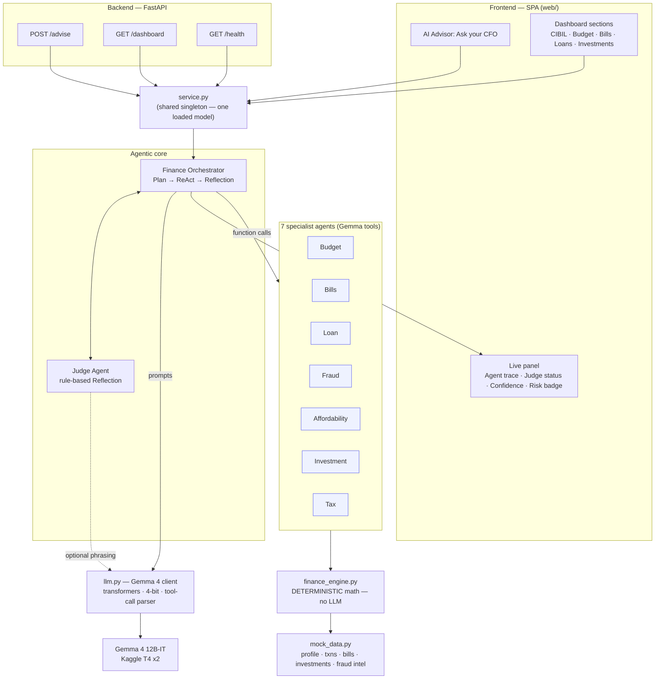
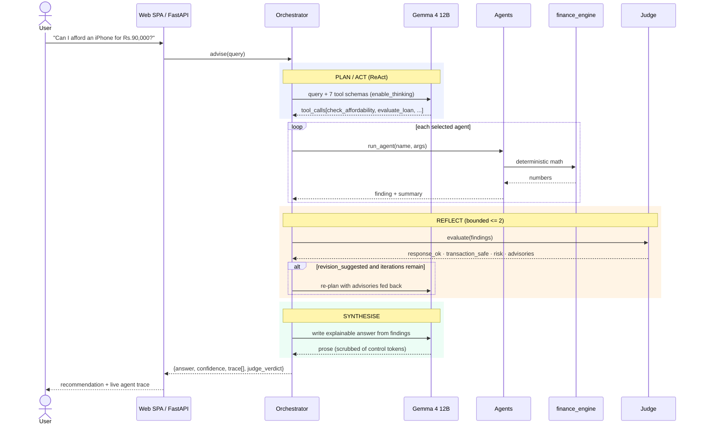
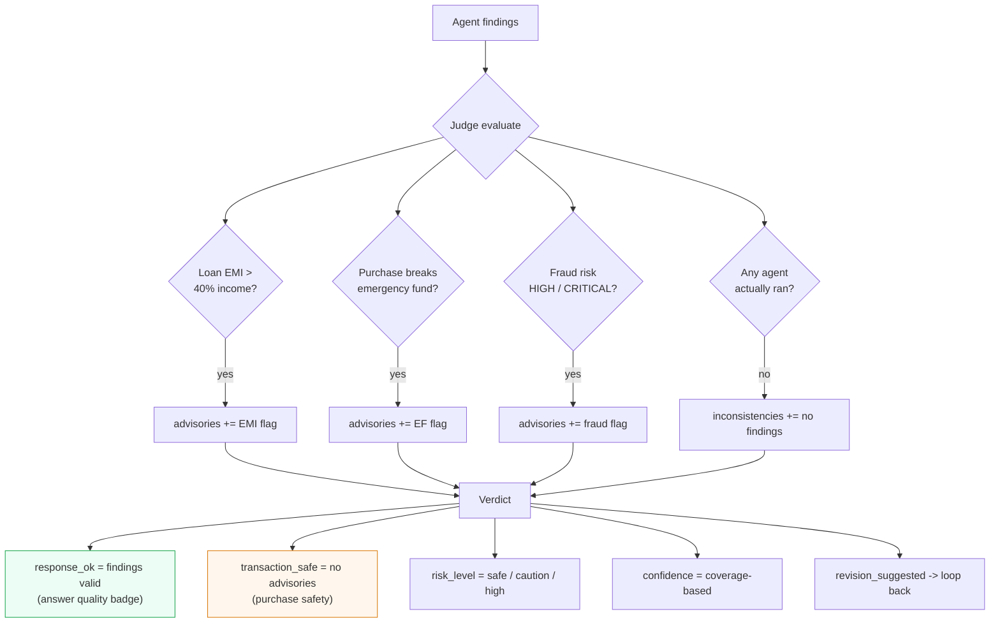
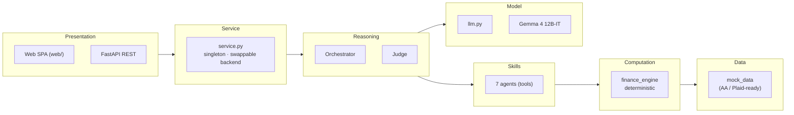
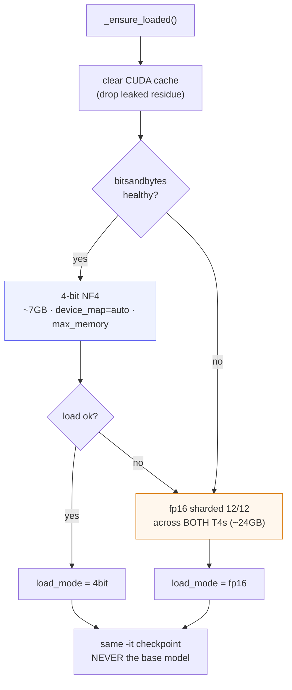

# Multi-Agent Personal CFO — Architecture

> Gemma 4 12B-IT driving a custom 7-agent orchestrator with native function
> calling, a deterministic Python finance engine, a Judge (Reflection) loop,
> exposed via a FastAPI backend that serves a single-page web app.

---

## 1. System overview

---

## 2. Request flow — one query end to end

---

## 3. The Judge — split verdict (Reflection)

> **Key design point:** `response_ok` (is the answer good) is separate from
> `transaction_safe` (is the purchase safe). A correct "do NOT pay this scam"
> reply is `response_ok = True` **and** `transaction_safe = False`.

---

## 4. Layers & responsibilities

| Layer | Module(s) | Rule |
|---|---|---|
| Presentation | `web/`, `api.py` | Render only — never compute |
| Service | `service.py` | One model instance; backend swap via `GEMMA_BACKEND` |
| Reasoning | `orchestrator.py`, `judge.py` | LLM plans/explains; Judge validates with rules |
| Skills | `agents.py` | Thin tools; decide *what*, not *the numbers* |
| Computation | `finance_engine.py` | All math; **no LLM arithmetic** |
| Data | `mock_data.py` | Mock now; real connectors are the interface's future work |
| Model | `llm.py` + Gemma 4 | Swappable client; 4-bit → fp16 fallback |

---

## 5. Model loading strategy (Kaggle T4 x2)

---

## 6. Design patterns → paper mapping

Grounded in *Agentic AI in Finance: A Comprehensive Overview* (Luqman et al.):

| Paper concept (§) | This system |
|---|---|
| Reflection (§4.1) | Judge Agent loop |
| Tool Use + Computation (§4.1 / §4.3) | Agents → deterministic `finance_engine` |
| Planning (§4.1) | Orchestrator selecting agents |
| Multi-Agent Collaboration (§4.1) | The whole system |
| Reasoning · Memory · Tools (§4.2) | Gemma 4 · conversation context · agent tools |
| ReAct (§4.1) | Orchestrator's plan→act loop |
| Risk: incorrect transactions (§5.2) | Deterministic math + Judge validation |
