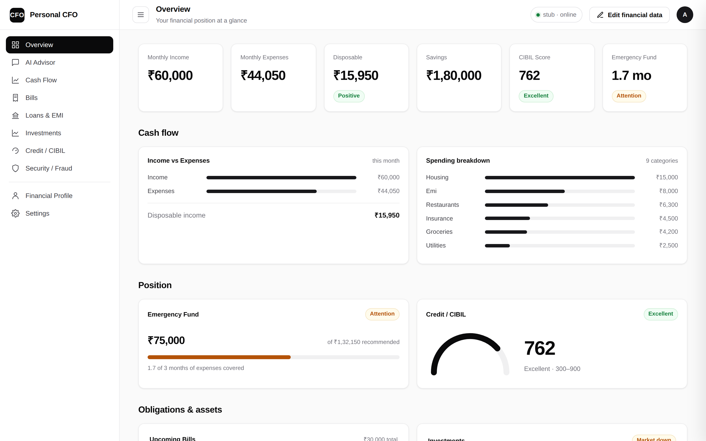
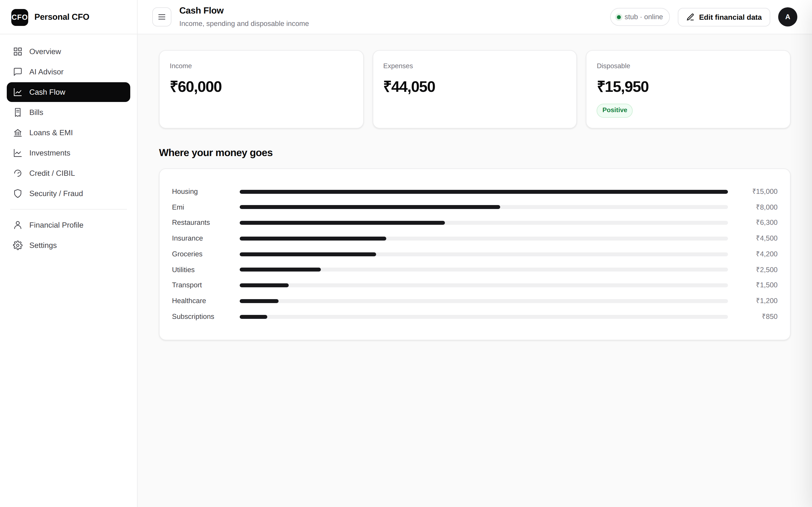
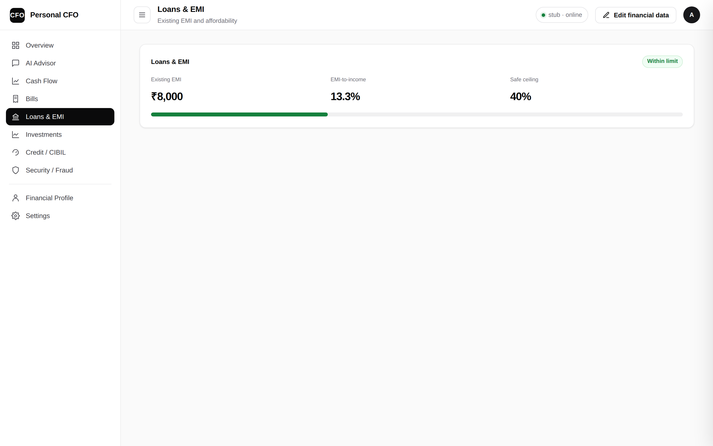
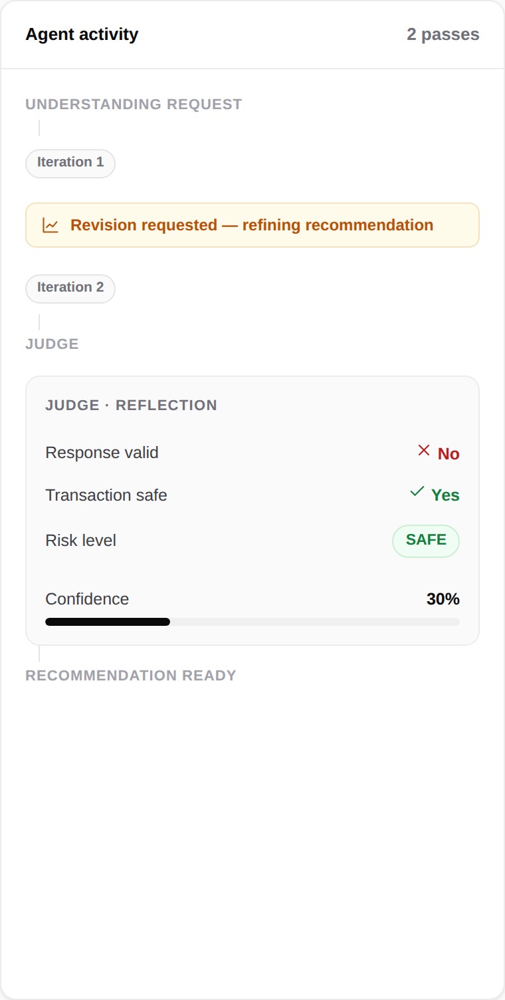

# Multi-Agent Personal CFO

A personal finance advisor powered by **Gemma 4 12B-IT**: a custom 7-agent
orchestrator with native function calling, a **deterministic Python finance
engine** (no LLM arithmetic), and a rule-based **Judge / Reflection loop** —
served over a FastAPI backend with a self-contained SPA frontend.

Built for the Kaggle Gemma hackathon.

> Ask *"Can I afford an iPhone for ₹90,000?"* and the system plans which
> specialists to call, runs the real math deterministically, has a Judge check
> the purchase against your emergency fund and EMI ratio, then writes an
> explainable answer — with the full agent trace shown live.

---

## Why it's built this way

The LLM **decides and explains**; it never does the arithmetic. Every number
comes from `finance_engine.py`, and a rule-based Judge validates each answer
before it reaches you. That split — probabilistic reasoning over deterministic
computation — is what makes financial advice from an LLM trustworthy.

A key design point: **`response_ok` (is the answer good) is separate from
`transaction_safe` (is the purchase safe)**. A correct *"do NOT pay this scam"*
reply is `response_ok = True` **and** `transaction_safe = False`.

See [`ARCHITECTURE.md`](ARCHITECTURE.md) for full Mermaid diagrams of the
request flow, Judge logic, layering, and model-loading strategy.

---

## Screenshots

### Overview dashboard
Deterministic financial snapshot — income vs. expenses, spending breakdown,
emergency-fund coverage, and CIBIL standing, all computed by `finance_engine.py`.



### Cash flow


### Loans & EMI


### AI Advisor — the Judge / Reflection loop
The right-hand panel shows the live agent trace and the Judge's **split
verdict**: the Judge flags a weak answer, requests a revision, and reports
`response_ok`, `transaction_safe`, risk level and confidence separately.



> Captured with the local **stub** backend (`GEMMA_BACKEND=stub`), so it runs
> without a GPU — hence the `stub · online` status pill. On a GPU host the same
> flow is driven by Gemma 4 12B-IT.

---

## Architecture at a glance

```
Frontend SPA (web/)  ──►  FastAPI (api.py)  ──►  service.py (one loaded model)
                                                       │
                                                       ▼
                                     Orchestrator ◄──► Judge      (plan → act → reflect)
                                          │
                                          ▼
                              7 specialist agents (Gemma tools)
                                          │
                                          ▼
                              finance_engine.py  (deterministic math)
                                          │
                                          ▼
                              mock_data / financial_store  (mutable, validated)
```

| Layer | Module(s) | Rule |
|---|---|---|
| Presentation | `web/`, `api.py` | Render only — never compute |
| Service | `service.py` | One model instance; backend swap via `GEMMA_BACKEND` |
| Reasoning | `orchestrator.py`, `judge.py` | LLM plans/explains; Judge validates with rules |
| Skills | `agents.py` | Thin tools — decide *what*, not *the numbers* |
| Computation | `finance_engine.py` | **All math; no LLM arithmetic** |
| Data | `mock_data.py`, `financial_store.py` | Mutable, Pydantic-validated store |
| Model | `llm.py` + Gemma 4 | Swappable client; 4-bit → fp16 fallback |

The 7 agents: **Budget · Bills · Loan · Fraud · Affordability · Investment · Tax**.

---

## Project layout

```
src/                     Python backend (core has zero third-party deps)
  api.py                 FastAPI app + REST endpoints + serves web/
  service.py             Shared singleton — loads the model once
  orchestrator.py        Plan → ReAct → Reflection loop
  judge.py               Rule-based Judge (split verdict)
  agents.py              7 specialist tools
  finance_engine.py      Deterministic financial math
  financial_store.py     Mutable, thread-guarded, versioned store
  schemas.py             Pydantic validation for every mutation
  llm.py                 Gemma 4 client (4-bit / fp16, tool-call parser)
  router.py              Intent routing + token budgets (cost optimisation)
  conversation.py        Multi-turn session memory
  formatting.py          Centralised number formatting + provenance
  mock_data.py           Profile · txns · bills · investments · fraud intel
  selftest.py            Runnable self-check
  test_advisor.py        Assertion-based tests (numeric, routing, latency…)
web/                     Self-contained SPA — no build step, no npm
notebooks/               Kaggle notebook + build_notebook.py (keeps it in sync)
docs/                    Q&A + architecture notes
ARCHITECTURE.md          Full diagrams
```

---

## Running it

### Core logic (no GPU, no model — deterministic engine only)
The core has **no third-party dependencies**. To exercise the engine, routing,
Judge, and store without loading Gemma:

```bash
cd src
python selftest.py          # runnable self-check
python test_advisor.py      # numeric / routing / multi-turn / latency tests
```

Some paths answer with **zero Gemma calls** (`test_fast_path_zero_gemma`) —
fast-data lookups are served straight from the deterministic engine.

### API server + web app
```bash
pip install -r requirements.txt
cd src
uvicorn api:app --host 0.0.0.0 --port 8000
```

Open `http://localhost:8000/` for the SPA. Key endpoints:

| Method | Path | Purpose |
|---|---|---|
| `GET`  | `/health` | Liveness |
| `GET`  | `/dashboard` | Deterministic financial snapshot |
| `POST` | `/advise` | Ask the CFO (returns answer + trace + Judge verdict) |
| `POST` | `/conversation/new` | Start a session |
| `GET`  | `/financial-data` | Read the mutable store |
| `POST`/`DELETE` | `/financial-data/{transactions,bills,investments}` | CRUD (Pydantic-validated) |

Edits to the store are validated and take effect **immediately** — the engine
and the next answer use the new values (the store is versioned for cache
invalidation).

### Gemma backend
Model selection is via environment variable:

```bash
GEMMA_BACKEND=auto   # default: real Gemma if available, else stub
CFO_USE_JUDGE=1      # set 0 to disable the Judge loop
```

On a GPU host (Kaggle T4 ×2 / Colab) it loads **Gemma 4 12B-IT** — 4-bit NF4
(~7 GB) with an automatic **fp16 sharded across both T4s** fallback if
bitsandbytes is unhealthy. Always the `-it` checkpoint, never the base model.

### Kaggle
`notebooks/multi_agent_cfo_kaggle.ipynb` is the submission notebook — fully
self-contained (every `src/` module and the `web/` SPA are written to disk via
`%%writefile`). `notebooks/build_notebook.py` regenerates it from `src/` + `web/`
so the notebook and source never drift.

To run it:

1. Upload the notebook to Kaggle (or open it there).
2. **Settings:** GPU accelerator **T4 ×2** (or L4 ×4), **Internet ON**, and
   accept the Gemma 4 license at `kaggle.com/models/google/gemma-4`.
3. **Run all.** The final section launches the FastAPI SPA and opens a
   token-free **cloudflared** quick tunnel, printing a public
   `…trycloudflare.com` URL — open it to use the live app (or record the demo).

---

## Design → paper mapping

Grounded in *Agentic AI in Finance: A Comprehensive Overview* (Luqman et al.):
Reflection (Judge loop), Tool Use + Computation (agents → deterministic
engine), Planning (orchestrator), Multi-Agent Collaboration (the whole system),
ReAct (plan→act loop), and mitigation of "incorrect transaction" risk via
deterministic math + Judge validation.
