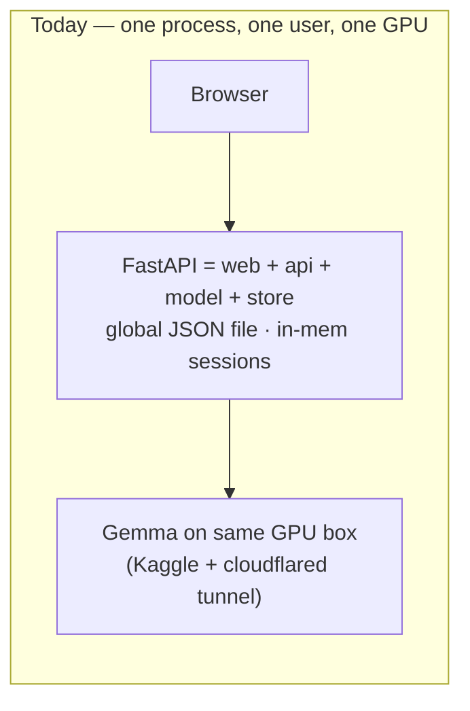
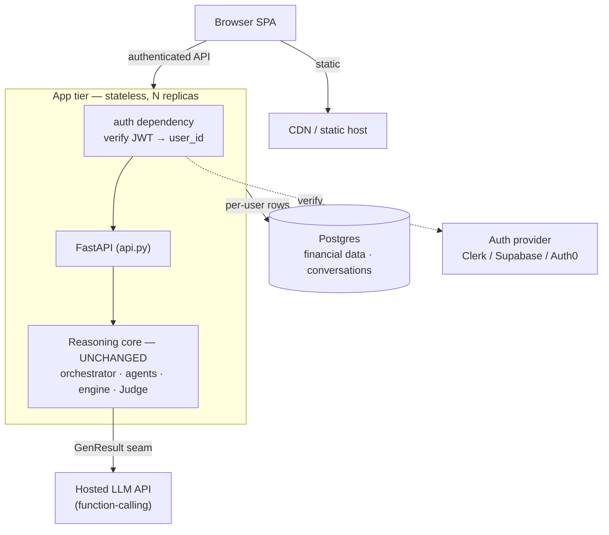

# From Hackathon to Product — Architecture Polish

> Decisions this plan assumes: **hosted LLM API** (no GPU tier) and
> **manual/user-entered data first** (no bank connectors, light compliance).
> Both are reversible later behind the same seams.

## The one idea

The reasoning core is already a clean, deep module. Everything that makes this a
"demo" and not a "product" lives in the **thin shell around it**, and that shell
touches exactly three things:

1. **The model seam** — `GenResult` in `llm.py`. The orchestrator/agents/Judge
   only ever see `GenResult(text, tool_calls=[{name, arguments}])`. Gemma's
   `<|tool_call>…<tool_call|>` wire-format is private to `TransformersBackend`.
2. **The data seam** — `financial_store` + `conversation`. Today both are
   single-user process globals (one JSON file, one in-memory dict).
3. **Identity** — there isn't any. The whole app assumes "the one user."

Productizing = swap the model seam to a hosted API, make the data seam per-user
on a real DB, and put auth in front. **The core does not change.**

## What stays untouched (the moat)

`orchestrator.py`, `agents.py`, `finance_engine.py`, `judge.py`, `router.py`,
`formatting.py`, `schemas.py`. Deterministic math, the Plan→ReAct→Reflection
loop, the split Judge verdict — none of it cares whether the tokens came from a
Kaggle GPU or an HTTP endpoint, or whose data it's reasoning over. Don't refactor
it to "clean it up for production." It's already the product.

## Current vs. target

The two big shape changes: the **model** moves from *inside the process* to *an
HTTP dependency* (so the app tier is now stateless and horizontally scalable),
and **state** moves from *process globals* to *Postgres* (so replicas share it
and it survives restarts).

## File-by-file

| File | Today | Change | Effort |
|---|---|---|---|
| `llm.py` | Gemma backends only | **Add `ApiBackend`**: call hosted API, map its native tool-calls → `GenResult`. `make_backend("api")`. | Additive, ~40 lines |
| `service.py` | global `_orch` singleton + global `_dash_cache` | Singleton `_orch` is now **fine** — it's a stateless HTTP client wrapper. Drop the global dashboard cache (single-user) or key it per user. | Small |
| `financial_store.py` | one global JSON file, module `_state` + `RLock` | Every function takes `user_id`; back with Postgres (SQLAlchemy). **Same public interface** — callers barely change. | Storage rewrite, interface stable |
| `conversation.py` | in-memory `_sessions` dict | Key sessions by `user_id`; persist (Postgres table). Survives restart + shared across replicas. | Moderate |
| `api.py` | endpoints call `store` directly, no auth | Add `current_user` FastAPI dependency; thread `user_id` into every `store`/`conversation`/`service` call. | Moderate |
| *(new)* `auth.py` | — | Thin dependency that verifies the provider's JWT and returns `user_id`. **Don't build login by hand** — use a provider. | Small |
| `notebooks/` | Kaggle + cloudflared | Deprecate for prod (keep as the "real Gemma" demo). Deploy as a container. | Replace |

## Two correctness points you can't skip

- **`financial_store`'s `threading.RLock` + global `_state` is single-process,
  single-user.** It must go for multi-replica — Postgres becomes the concurrency
  authority (row-per-user). This isn't optional polish; it's why two users would
  otherwise see each other's money.
- **`/advise` is a sync `def`** → runs in FastAPI's threadpool. With a hosted
  LLM the call is I/O-bound, so concurrency is capped by threadpool size. Fine to
  ship; make it `async def` + `await` an async HTTP client when concurrency bites.
  `ponytail: sync + threadpool, go async when p95 latency under load hurts`.

## Migration order — each stage ships on its own

1. **Backend swap.** Add `ApiBackend`, set `GEMMA_BACKEND=api`. *Kills the GPU
   dependency* — the app now runs on any CPU box. Still single-user, but already
   deployable somewhere real. ← highest leverage, do first.
2. **Persistence.** Move `financial_store` + `conversation` to Postgres, still a
   single hardcoded `user_id="default"`. Survives restart; ready for replicas.
3. **Identity.** Add the auth dependency; key the now-Postgres state by real
   `user_id`. **This is the actual multi-tenant moment.**
4. **Hosting.** Container + managed Postgres + SPA on a CDN. Public product.

Order is deliberate: (1) removes the only hard deploy blocker (the GPU), (2)+(3)
are the multi-tenant core, (4) is ops.

## Corners cut on purpose

- **No Redis.** Postgres-backed sessions are fine at launch scale.
  `ponytail: DB sessions, add Redis when session write QPS hurts`.
- **No async LLM calls yet** (see above).
- **No bank connectors.** `mock_data` already isolates the data source; real
  Account-Aggregator/Plaid connectors slot in behind `financial_store` later
  without the core noticing.
- **Auth is bought, not built.** One less thing to get wrong at a trust boundary.
